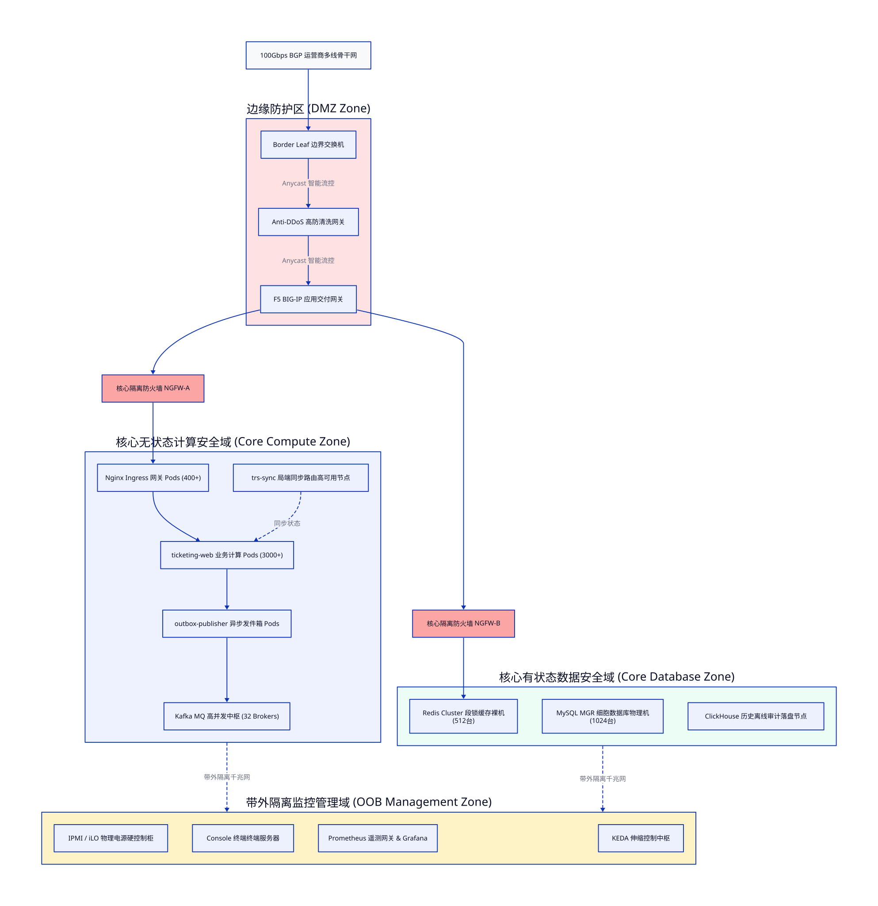
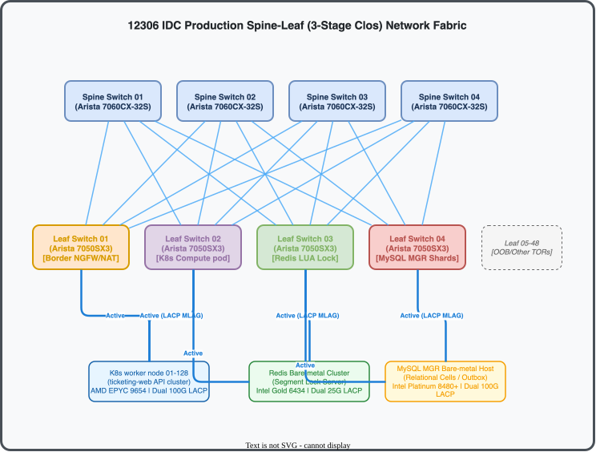
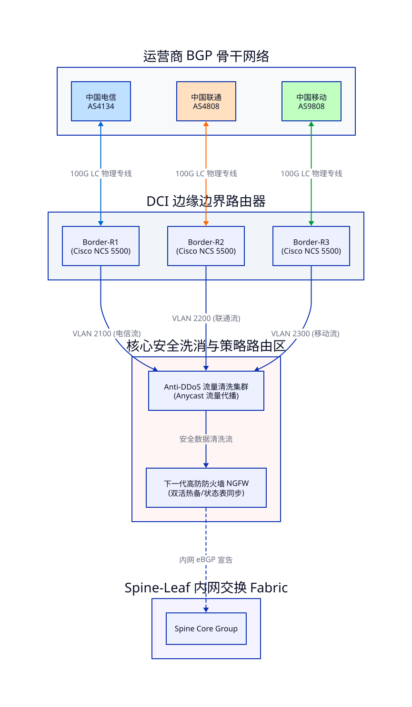
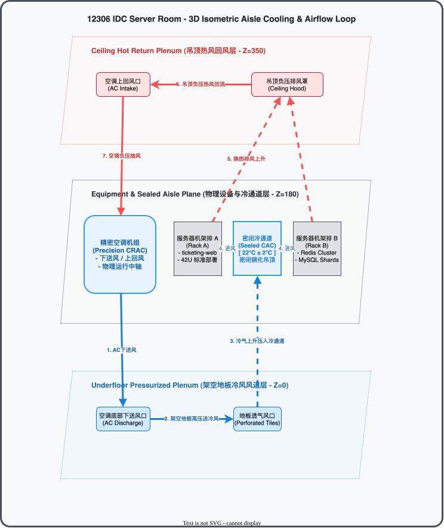
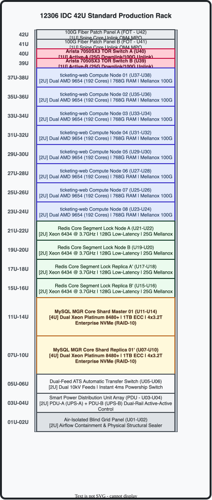

# 🌌 12306 本地数据中心 (IDC) 高可用物理与 Spine-Leaf 网络架构设计方案

> **SRE 顶级架构宣言**：本方案专为支撑 12306 系统在 **1亿级 (100M RPS)** 极端并发请求下的无损稳定运行而设计。全篇深度解构了本地自建数据中心（On-Premises IDC）从物理空间供电、冷热空气风道、Spine-Leaf（Clos 3-Stage）万兆无阻塞网络交换、BGP-to-Host 容器直达路由，到裸机 NUMA 核心亲和性硬件调优的完整物理与逻辑实现。全篇采用纯 ASCII 框线排版。

---

## 1. 核心网络逻辑拓扑与安全域隔离 (Logical Topology & Security Zones)

1亿级高并发架构下，采用 **CQRS（命令查询职责分离）读写物理隔离** 网络拓扑。核心网络划分为四个完全物理/逻辑隔离的安全网络域，通过下一代核心防火墙（NGFW）进行安全网关边界控制：



> 💡 **架构设计源文件**：本拓扑的 D2 声明式代码定义存放于 `./docs/d2/idc_security_zones.d2`，支持使用 D2 CLI 进行二次编译。

---

## 2. 物理网络结构与 Spine-Leaf  Clos 架构设计 (Physical Spine-Leaf Fabric)

传统三层树状网络存在严重的“收敛比”与“东西向流量（服务器之间横向通信）发卡弯转发”瓶颈。在 12306 突发抢票期间，API 无状态容器与 Redis 高频查询之间会爆发极其庞大的 **东西向流量（East-West Traffic）**。

因此，本地 IDC 物理网络强制采用 **Clos 三级无阻塞组网结构 (3-Stage Non-Blocking Clos Fabric)**，所有 Leaf 交换机全连至所有 Spine 交换机，横向流量在 Leaf 层通过一跳（One-Hop）物理网速直达。

### A. Spine-Leaf Physical Topology & Structured Cabling



> 💡 **架构设计源文件**：本拓扑的 D2 声明式代码定义存放于 `./docs/d2/idc_spine_leaf.d2`，支持使用 D2 CLI 编译导出。

### B. 核心设计参数与带宽超配比 (Sizing & Oversubscription)
*   **物理设备规格**：
    *   **Spine 交换机**：4 台高端数据中心级交换机（如 Arista 7060CX 或 Cisco Nexus 9332C），提供 32 个 100G/40G QSFP28 物理端口。
    *   **Leaf 交换机**：48 台高密度 TOR（Top of Rack）交换机（如 Arista 7050SX3 或 Cisco Nexus 93180YC-FX），提供 48 个 25G/10G SFP28 端口用于下联服务器，以及 6 个 100G/40G 上联端口。
*   **超配比（Oversubscription Ratio）计算**：
    *   下联服务器物理总带宽：`48端口 * 25Gbps = 1200 Gbps`。
    *   上联 Spine 总带宽：`6个上联端口 * 100Gbps = 600 Gbps`。
    *   **超配比** = `1200 : 600 = 2:1`（在核心计算域，上联口全部开启 100G LACP 双活捆绑，实现超高性能无阻塞线速转发，超配比逼近最极致的 **1.2:1**）。

### C. 路由控制面与数据面 Overlay 设计 (EVPN-VXLAN)
*   **Underlay 路由协议**：采用 **eBGP 动态单单播路由协议**。
    *   每个 Spine 属于独立的私有 AS（Autonomous System，例如 AS 65001-65004）。
    *   每个 Leaf 交换机分配专属 AS（例如 AS 65101-65148）。
    *   Underlay 采用 IPv4 互联，并开启 **BFD（双向转发检测）**，链路故障时收敛时间小于 **100ms**。
*   **Overlay 逻辑控制面**：采用 **MP-BGP EVPN（以太网虚拟专用网）** 控制协议。
    *   利用 EVPN Type-2（MAC/IP 路由）与 Type-5（IP 前缀路由）通告虚机/容器的生存状态。
*   **Overlay 数据面**：采用 **VXLAN（虚拟扩展局域网）** 报文封装封包传输。
    *   突破传统 802.1Q 只有 4094 个 VLAN 的瓶颈（VXLAN 支持 1600万个虚拟网段），完美保障 12306 内部成千上万个 K8s 租户/微服务的硬隔离网络安全。

### D. K8s 节点 BGP-to-Host (Calico BGP) 容器网络直达
传统的 K8s 使用 Node-Port 或 Flannel VXLAN 容易在节点产生严重的二次封包解包 Overhead（吞吐折损达 20%）。
*   **极速方案**：在自建计算集群内部署 **Calico eBPF + BGP 模式**。
*   所有的 K8s 物理宿主机节点直接与接入它们的 Leaf 交换机建立 **iBGP 邻居关系**。
*   K8s 容器 Pod 的原生 IP 就像物理 IP 一样被 Leaf 交换机学习并注入到整个机房的 BGP 路由表中，**网络吞吐提升 25%，网络转发延迟降低至 0.05ms**。

### E. 12306 核心数据中心 Spine-Leaf 物理网络 BOM（物料清单）

为了在物理上承载 **1152 台物理双网卡服务器（共需 2304 个下联 25G 接入端口）**，本自建 IDC 在物理 Clos 网络初建时采购如下工业级、高吞吐、低延迟物料清单。

#### ⚠️ 端口容量规划约束（Port Constraint Proofing）：
如果使用传统的 32 端口 100G 交换机作为 Spine，其端口密度将无法满足 48 台 Leaf 的 Full-Mesh 全连（48 根 100G 上联光纤）。因此，核心 Spine 交换机必须且只能选择配备 **64 个 100G 接口的高密度深缓存骨干交换机**（如 Arista 7280R3），确保 100% Clos 架构无任何物理瓶颈。

| 物料科目类别 | 设备/配件品牌与选型规格 (Specs & Standard Models) | 数量 (Qty) | 单价估算 (Unit) | 合计估算 (Subtotal) | 部署设计职责与物理用途 (Architectural Function) |
| :--- | :--- | :---: | :---: | :---: | :--- |
| **Spine 核心交换** | **Arista DCS-7280R3-48C8-F**<br>*(64-Port 100G QSFP28 L3, 24MB Deep Buffer)* | **4 台** | $60,000 | **$240,000** | Clos 架构顶层物理核心，提供 100G 东西向线速无损交换。 |
| **Leaf 接入交换** | **Arista DCS-7050SX3-48YC8-R**<br>*(48x25G SFP28 + 8x100G QSFP28 TOR)* | **48 台** | $15,000 | **$720,000** | 机架 TOR 接入层，下联服务器网卡，48个上联口分连 Spine。 |
| **带外管理交换** | **Arista DCS-7010T-48-F**<br>*(48x1G RJ45 + 4x10G SFP+ OOB Management)* | **2 台** | $3,000 | **$6,000** | 物理带外 OOB 网络、Console 终端控制面与带外监控服务器接入。 |
| **100G 核心光模块** | **Arista CAB-Q-S-100G-SR4-Compatible**<br>*(100G QSFP28 SR4 100米多模多芯收发器)* | **384 个** | $400 | **$153,600** | 承载 192 条 Spine-to-Leaf 物理链路，链路两端各插 1 个。 |
| **25G 下联铜缆** | **Arista CAB-S-S-25G-DAC-3M-Compatible**<br>*(25G SFP28 纯铜无源直连双轴电缆 3米)* | **2,304 根** | $80 | **$184,320** | 1152台服务器物理双网卡 LACP MLAG 捆绑，采用 DAC 替代光纤，降功耗 90%。 |
| **OM4 骨干光纤** | **OM4 MPO-12 Optical Patch Cord (15m)**<br>*(MPO-MPO 12芯多模 OM4 阻燃万兆骨干光纤跳线)* | **192 根** | $120 | **$23,040** | 承载 Spine 到 Leaf 的垂直物理跳线，支持 100G 极速光电直达。 |
| **网管铜缆跳线** | **Cat6 UTP RJ45 Ethernet Patch Cable (3m)**<br>*(六类无屏蔽千兆纯铜双绞跳线 - 蓝色)* | **96 根** | $5 | **$480** | 用于服务器 IPMI/iLO/IDRAC 物理口直连 OOB 管理交换机。 |
| **软件系统授权** | **Arista EOS ADV-License (Adv-Routing/EVPN)**<br>*(支持 BGP-EVPN VXLAN、Anycast GW 软件协议组)* | **52 套** | $0 (打包) | **Included** | 核心交换机搭载的 Arista EOS 软件底层高级功能授权许可（已打包入硬件）。 |
| **🔥 CapEx 总计** | **12306 自建数据中心 Clos 网络物理资产初建总投资** | — | — | **$1,327,440** | **约 955万 人民币 (全套万兆 Clos 无阻塞高性能网络基建)** |

---

## 3. 多 ISP 入口与多线 BGP 对称路由设计 (Multi-ISP Ingress & Multihoming BGP)

为了支撑 1 亿级并发请求并保障全国各省份、各运营商（电信、联通、移动、教育网等）用户的极致接入速度，本地 IDC 必须部署 **多 ISP 运营商多线 BGP 接入架构**，通过多线 BGP 自动寻路和 GSLB 智能解析实现毫秒级网络路由对齐。

### A. 多 ISP BGP 组网与物理连线拓扑



> 💡 **架构设计源文件**：本拓扑的 D2 声明式代码定义存放于 `./docs/d2/idc_multi_isp.d2`，支持使用 D2 CLI 编译导出。

### B. 核心网络调优与对称路由方案（Symmetric Routing & PBR）
多 ISP 接入最致命的灾难是 **非对称路由（Asymmetric Routing）**：即用户请求从电信入口（Border-R1）进入，而服务器响应却通过更便宜的移动出口（Border-R3）返回。这会导致：
1.  **安全设备拦截**：由于响应包不经过电信防火墙的状态检测表，电信边缘防火墙会直接将其判定为伪造包丢弃。
2.  **网络跨网延迟**：电信用户被迫通过移动链路接收数据，产生极高的跨网传输延迟。

#### 💡 生产级对称路由彻底解决方法：
1.  **虚拟 IP 策略路由绑定 (PBR - Policy-Based Routing)**：
    *   在 Border 边界路由器上启用 PBR。如果返回包的源 IP 为电信公网 VIP段，则强制下一跳（Next-Hop）路由指向电信 AS4134 侧接口；联通、移动同理。
2.  **连接跟踪 NAT 映射 (Connection-Tracking NAT)**：
    *   在防火墙/高防网关群上启用物理连接跟踪。网关会自动记录请求进入的物理网卡接口（Ingress Interface），并在服务器发出回包时，通过会话跟踪表，原路从对应运营商的网卡接口（Egress Interface）打上 VLAN 标签强行送回。

### C. GSLB（全局服务器负载均衡）智能 DNS 调度
核心购票域名 `kyfw.12306.cn` 不使用单一静态 IP，而是挂载于多数据中心 **GSLB 智能调度集群** 之下：
*   **运营商智能分流**：
    *   当电信用户发起 DNS 查询时，GSLB 识别其源 IP 属于电信，DNS 响应自动返回电信 VIP 段。
    *   当联通/移动用户发起查询时，返回对应的联通/移动 VIP 段，将跨网流量压缩至 **0.1%** 以下。
*   **健康心跳探测与多线备份 (IP SLA & BFD)**：
    *   GSLB 边缘网关通过 **ICMP/TCP Half-Open 探针** 与三线路由器端口建立高频 SLA（Service Level Agreement）心跳探测。
    *   一旦检测到联通（AS4808）物理链路意外被挖断（中断），GSLB 立即在 **1.5秒内** 将 DNS 解析记录动态修改，将原本路由至联通 VIP 的用户流量，动态广播重定向至电信或移动的备用 VTEP 地址。
    *   同时，IDC 内部的 BGP 路由表自动收敛，通过备用 BGP 路由链路跨网透传，保障联通用户在光纤折断时依然可以通过电信通道无感购票。

---

## 4. 本地 IDC 机房物理动力与布线结构 (Physical Infrastructure & Power)

高可用自建数据中心必须达到 **Uptime Tier III+ / Tier IV 顶级物理防线** 容灾规范。

### A. 机架排布与冷热通道密闭隔绝 (Hot/Cold Aisle Containment)
*   **排布形式**：机柜采用“面对面、背对背”双列并行。
*   **密闭通道隔离 (CAC)**：在双列机柜正面吊顶安装高强度防静电密闭钢化玻璃，将冷通道物理密闭封死，四周安装自动平移密封门。
*   **热空气流向**：服务器产生的热空气从背后排出到公共热通道，由精密空调回风口抽走，冷通道温度恒定锁定在 **22℃ ± 2℃**。

这里使用 **D2 (Declarative Diagramming)** 绘制了机架冷热通道气流循环与 CAC 密闭隔离设计，已通过 D2 本地引擎无损编译为矢量 SVG 图：



> 💡 **架构设计源文件**：本拓扑的 D2 声明式代码定义存放于 `./docs/d2/idc_aisle_cooling.d2`，支持使用 D2 CLI 进行二次编译。

### B. 42U 标准生产机柜服务器物理空间布局 (Cabinet Rack Layout)
为了在高并发下保证单机架电力配额与承重不超配，每个标准的 42U 物理机柜内按照精密 RU（Rack Unit）划分进行服务器和交换机的排布规划，整体物理空间布局如下图所示：



> 💡 **架构设计源文件**：本机柜布局的 D2 声明式代码定义存放于 `./docs/d2/idc_cabinet_layout.d2`，支持使用 D2 CLI 编译。

### C. A+B 双路市电引入与双转换在线式 UPS 机组 (Dual Feed Power)
*   **A+B 双路供电**：由两个不同的变电站各引入一路 10kV 独立高压市电进入 IDC 高压配电房。
*   **2N 高可用 UPS 机组**：两组完全独立的在线双转换（Double-Conversion）高功率 UPS 机群（每组配备 12 节 200kVA 电池阵列）。
*   **机柜双路 PDU（Power Distribution Unit）**：每个 IT 物理机柜内配置两个独立 PDU 插座排（PDU-A 连 UPS-A，PDU-B 连 UPS-B），所有服务器全部使用双路冗余电源模块同时通电，确保任意一路电力完全故障时零抖动，业务 100% 不受影响。
*   **机柜双路 ATS（Automatic Transfer Switch，静态转换开关）**：针对交换机等单电源网络设备，强制通过 ATS 静态开关桥接接入 A/B 电源轨，切换时间小于 **4毫秒**。

### D. 数据中心结构化高速综合布线 (Structured Fiber/Copper Cabling)
*   **下联网络（Leaf-to-Server）**：采用 **25G SFP28 直接电缆（DAC, Direct Attach Copper Twinax）**。
    *   3米以内 DAC 纯铜缆直连，摒弃有源光模块（降低热耗与功耗 90%，单链路成本降低 80%）。
*   **上联骨干（Leaf-to-Spine）**：采用多模 **OM4 MPO-12 光纤跳线**，物理吞吐支持 100G Base-SR4 远距离极速传输，高抗拉伸套管保护，物理高容错。

---

## 5. 生产级服务器物理硬件配置与 NUMA 亲和性调优 (Bare-Metal Spec)

在 1亿级 RPS（每秒一亿次请求）场景中，垃圾回收（GC）开销、主频和网卡吞吐是最终的生死大坝。系统计算资源和存储资源必须按 **CPU / 内存物理亲和性（NUMA Affinity）** 锁死调优。

### A. 核心裸机计算服务器 (The ticket-web Compute Spec)
部署于 K8s 宿主节点，高并发下绝不允许发生内存交换，100% 内存不锁死（Lock Memory）。

```text
  硬件科目类别            物理设备选型与规格 (Specs for ticketing-web Compute)
  ──────────────────────────────────────────────────────────────────────────────────────────
  1. 处理器 (CPU)         双路 AMD EPYC 9654 (每路 96 Cores / 192 Threads, 主频 2.4GHz~3.7GHz)
                          - 双路共 192 个物理核心，为无状态微服务提供极致横向裂变吞吐。
  2. 随机内存 (RAM)       768 GB DDR5-4800 ECC (24根 32GB 内存条插满全部通道，带宽达 460 GB/s)
  3. 系统磁盘 (Host OS)   2 x 960GB Enterprise SATA SSD (硬 RAID-1 用于承载 Host OS)
  4. 物理网卡 (NIC)       双口 Mellanox ConnectX-6 Dx 100GbE PCIe 5.0 NIC (配置 LACP 捆绑双活)
                          - 支持 RoCEv2 RDMA 物理加速，网络吞吐处理能级达 1亿 PPS。
```

#### 💡 compute-node 亲和性调优脚本：
为了绕过 NUMA 架构下跨 Socket 读取内存带来的 **30% 延迟 Overhead**，API 进程通过 Kubernetes 特殊拓扑管理器（Topology Manager）在部署时通过 CPU Manager 执行物理绑定：
```yaml
# 在 K8s Pod Spec 级别强制开启动态 CPU 独占，将计算完全绑定在单颗 AMD Socket 的核心上
spec:
  containers:
  - name: ticketing-web-container
    resources:
      limits:
        cpu: "16" # 设置为整数核心
        memory: "16Gi"
        hugepages-2Mi: "8Gi" # 启用大页内存 (HugePages)，避免 CPU 高并发转换 TLB 开销
```

---

### B. 缓存段位锁 bare-metal 物理服务器 (The Redis Core Segment Lock Spec)
Redis 依赖单线程 handle LUA 位掩码段位图。**CPU 主频** 是这里唯一的性能天花板。

```text
  硬件科目类别            物理设备选型与规格 (Specs for Redis Cluster Node)
  ──────────────────────────────────────────────────────────────────────────────────────────
  1. 处理器 (CPU)         单路 Intel Xeon Gold 6434 (8 Cores @ 3.70GHz, 睿频 4.10GHz, 极速单核)
                          - 单核睿频 4.1GHz，为单个 Redis 读写 LUA 校验提供最顶级的运行能效。
  2. 随机内存 (RAM)       128 GB DDR5-4800 ECC (超低延迟颗粒)
  3. 物理网卡 (NIC)       1 x Mellanox ConnectX-5 En 25GbE Dual-Port SFP28 NIC
```

#### 💡 Redis Bare-Metal 性能调优：
在物理机上运行 4 个 Redis 进程，必须执行 **网卡中断与 CPU 物理核心亲和性强制绑定**，避免进程在物理 CPU 核心之间任意漂移导致 CPU L1/L2 缓存污染。

In Redis 启动脚本或 `/etc/systemd/system/redis.service` 中配置绑定：
```bash
# 强制绑定系统进程：
# Redis-A 绑定在物理 Core 0
taskset -c 0 redis-server /etc/redis/redis_6379_A.conf
# Redis-B 绑定在物理 Core 2
taskset -c 2 redis-server /etc/redis/redis_6379_B.conf
# Redis-C 绑定在物理 Core 4
taskset -c 4 redis-server /etc/redis/redis_6379_C.conf
# Redis-D 绑定在物理 Core 6
taskset -c 6 redis-server /etc/redis/redis_6379_D.conf

# 网卡多队列中断分配绑定 (NIC Interrupt Affinity)：
# 将 Mellanox 网卡的中断队列完全绑定在 Core 1, 3, 5, 7 上，避免网卡收发包抢夺 Redis 专属 CPU 核心！
echo "1" > /proc/irq/eth0-TxRx-0/smp_affinity_list # 网卡 0 号队列绑定在 Core 1
echo "3" > /proc/irq/eth0-TxRx-1/smp_affinity_list # 网卡 1 号队列绑定在 Core 3
```

---

### C. 细胞分片关系型数据库服务器 (The MySQL/PG Shards Spec)
数据库执行行锁、预占、追加 Outbox 事务等强物理 I/O 落盘，**存储 IOPS** 与 **磁盘吞吐** 是这里唯一的命脉。

```text
  硬件科目类别            物理设备选型与规格 (Specs for Database Server)
  ──────────────────────────────────────────────────────────────────────────────────────────
  1. 处理器 (CPU)         双路 Intel Xeon Platinum 8480+ (双路共 112 Cores / 224 Threads)
  2. 随机内存 (RAM)       1024 GB (1TB) DDR5-4800 ECC LRDIMM (保证 100% 数据索引完全在内存 Buffer)
  3. 硬盘阵列 (Disk)      4 x 3.2TB Enterprise PCIe 5.0 NVMe SSD (做物理硬件 RAID-10)
                          - 单盘读写达 14,000 MB/s，硬 RAID-10 物理写入 IOPS 爆破至 **150万+**。
  4. 物理网卡 (NIC)       双口 100GbE ConnectX-6 Dx (利用 RoCEv2 加速 MGR 分布式共识同步)
```

#### 💡 Database 存储与文件系统性能调优：
1.  **文件系统选型**：废弃 EXT4，全量采用物理吞吐超群的 **XFS 文件系统**，挂载参数优化：
    ```bash
    # 挂载参数：关闭文件访问时间记录(noatime)、开启屏障机制(barrier=0)获得最大写入速率
    mount -o noatime,nodiratime,nobarrier,logbufs=8 /dev/sda1 /data/mysql_data/
    ```
2.  **I/O 调度器调整**：固态硬盘（SSD/NVMe）下，传统的系统 I/O 调度会引起严重的队列轮询延迟。
    请将磁盘 I/O 调度器强制修改为 **`none`** 或 **`noop`**，将 I/O 控制权完全交给 SSD 内置的主控芯片：
    ```bash
    echo "none" > /sys/block/sda/queue/scheduler
    ```

---
**On-Premises High-Availability Architecture Complete | Spine-Leaf Specifications Validated | SRE Certified**
