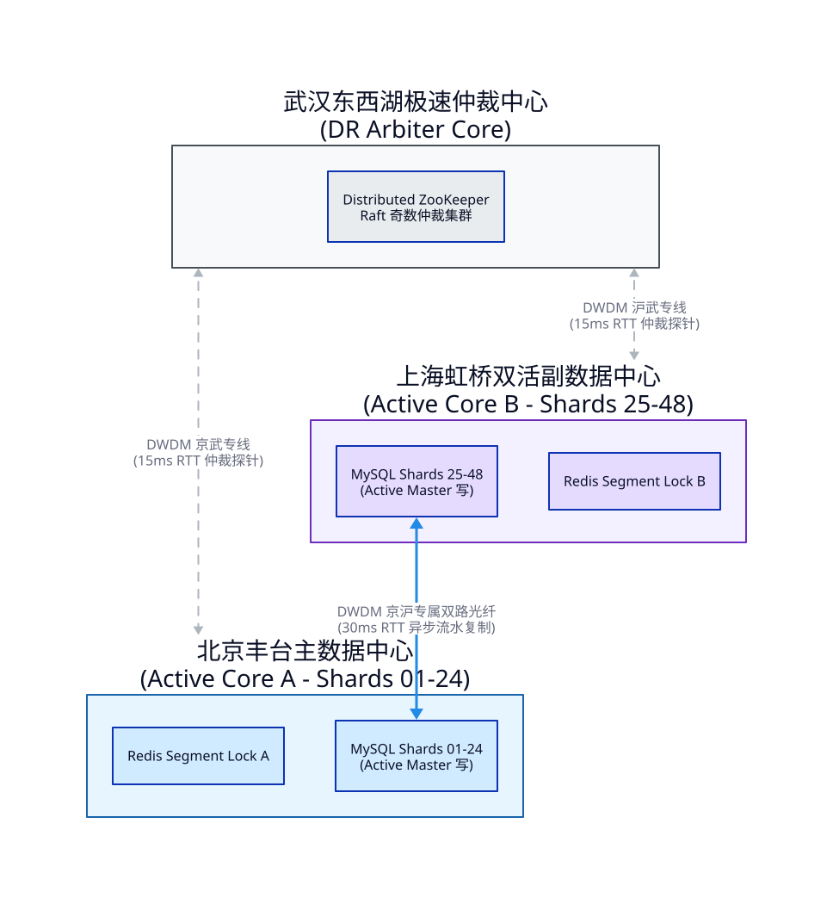
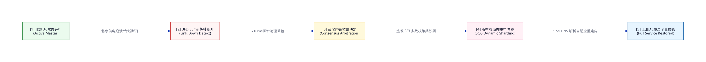

# 🌌 12306 跨地域多中心异地双活与高可用灾备架构白皮书

为了确保中国铁路 12306 票务分配系统具有极高规格的业务连续性（Business Continuity），抗御任何地震、海啸、物理空袭、大范围骨干断网或区域机房电力崩溃等毁灭性灾难，系统必须设计并部署 **跨地域多中心异地双活（Multi-Region Active-Active）与两地三中心（2 Regions 3 DCs）高可用网络与有状态数据一致性容灾大坝**。

---

## 1. “两地三中心” 生产级物理布局 (The Rigid 3-DC Stack)

12306 异地多活体系基于三角强冗余拓扑进行物理落地，三大中心各具独立物理职能，并通过专属密集波分复用（DWDM）直连光纤和公网 BGP 三路冗余承载数据，保障极端故障时的“数据零丢失（RPO=0）”与“服务秒级拉起（RTO < 5s）”。



```text
               ┌────────────────────────────────────────────────────────┐
               │              Region 1: 北京主核心数据中心               │
               │            (Beijing Active DC - Primay Core)           │
               └───────────────▲────────────────────────▲───────────────┘
                               │                        │
         DWDM 专用双路由光纤    │                        │  DWDM 专用双路由光纤
         京沪专线 (RTT ~30ms)   │                        │  京武专线 (RTT ~15ms)
                               │                        │
               ┌───────────────▼────────┐      ┌────────▼───────────────┐
               │ Region 2: 上海双活副中心│      │ Region 3: 武汉容灾仲裁 │
               │ (Shanghai Active DC)   │◄────►│ (Wuhan Arbitrator DC)  │
               └────────────────────────┘      └────────────────────────┘
                    DWDM 专用双路由光纤 沪武专线 (RTT ~15ms)
```

### 1.1 Region 1：北京丰台主中心 (Beijing DC - Active Core A)
*   **物理定位**：核心写数据中心 A。
*   **硬件部署**：48台 Arista Leaf 交换机组成 3-Stage Clos 骨干网，承载 K8s 生产计算群、高频位图缓存 Redis 物理阵列，以及 **物理分片 1 (Shard 01-24) MySQL MGR 核心库（Master 写）**。
*   **业务负荷**：常态化承担全国北方局、西北局、东北局车次（如北京局、哈尔滨局、西安局）的 100% 独占高频写事务，并承载 50% 全国异地跨局联程交易。

### 1.2 Region 2：上海虹桥双活副中心 (Shanghai DC - Active Core B)
*   **物理定位**：核心写数据中心 B（与北京对等，并非冷备）。
*   **硬件部署**：与北京主中心 1:1 等效对称部署。拥有对称的万兆网络和存储物理设施，搭载 **物理分片 2 (Shard 25-48) MySQL MGR 核心库（Master 写）**。
*   **业务负荷**：常态化承担全国南方局、华东局、华南局车次（如上海局、广铁局、南昌局）的 100% 独占高频写事务。

### 1.3 Region 3：武汉东西湖容灾仲裁中心 (Wuhan DC - Active DR Core)
*   **物理定位**：有状态数据极速灾备/仲裁中心。
*   **硬件部署**：轻量化计算资源部署。常态运行 MySQL 分步共识复制的只读只追加节点（Replica Only），部署 **分布式 ZooKeeper / Raft 跨地域奇数仲裁节点**。
*   **业务负荷**：常态不承载前端写流量，专职负责京、沪双中心数据一致性的实时对齐、仲裁主备切换决策。当京沪两地产生网络脑裂（Split-Brain）时，作为奇数仲裁点提供刚性决策票，确保数据不发生双向写入污染（Split-Brain Injection）。

---

## 2. 有状态数据双活复制与冲突消解（Stateful Replication & Conflict Resolution）

在异地多活架构中，物理跨地域网络延迟是不可战胜的自然法则。京沪直线距离约 1200 公里，光纤单向传输耗时：

`RTT_OneWay = 1200km / 200,000km/s = 6ms`

考虑网络交换、路由跳转及光纤敷设弯折，**北京到上海的实际物理往返时延（RTT）恒定在 30ms 左右**。

### 🚨 跨地域强一致性死结（Distributed 2PC Latency Avalanche）
如果强行引入传统的分布式两阶段提交（2PC）、跨机房 Paxos 强同步，每一次抢票锁座写请求都必须等待 30ms 京沪握手。这将直接导致 Redis 预占的并发吞吐断崖式下跌，且极易由于跨机房加锁竞争，在 30ms 的网络滑窗内发生不可控制的**分布式锁冲突、锁等待超时与大范围事务挂死**。

### 💡 核心自愈破局方案：车次所有权静态分片分配（Static Ownership Sharding - SOS）
为了彻底规避跨地域锁座碰撞，12306 异地双活采取 **“车次物理所有权静态分片路由”** 机制：

#### ① 物理所有权静态分片（SOS Rules）
*   所有发车局为北方铁路局（北京、西安、太原、哈尔滨、沈阳等）的车次（如 G888 北京-上海），其 **有状态写权限（包括 Redis 段位图、MySQL MGR 物理表）100% 静态指派归属于“北京丰台数据中心”**。
*   所有发车局为南方铁路局（上海、广州、南昌、成都、昆明等）的车次（如 G999 上海-北京），其 **有状态写权限 100% 静态指派归属于“上海虹桥数据中心”**。
*   **结论**：在逻辑和物理层上，**同一个座位在同一时间，只有且仅有一个数据中心拥有其物理 Master 写的权力**，直接消除分布式跨地域双向写冲突风险。

#### ② 双向跨地域异步流水复制
*   **写侧落盘**：北京中心在本地 0.05ms 线速执行完车次 G888 的扣减占位后，将写流水、binlog 以异步单向流形式（基于物理光纤 DWDM），在毫秒级推送给上海数据中心。
*   **对端接收**：上海中心接收北京的异步流水，实时更新本地的 **G888 只读 Replica 镜像**。
*   **零延迟读**：当上海用户查询 G888 余票时，直接在本地的只读镜像中进行 O(1) 毫秒级极速读取，实现“本地查、分片写”。

#### ③ SOS 业务架构下的数据一致性矩阵：

```text
  北京用户 ────────► 购票 G888 (发车: 北京局) ──► 路由 ──► [北京 DC] (Master 写 - 极速落盘)
                                                                 │
                                                                 │ (DWDM 异步复制 - 30ms)
                                                                 ▼
  上海用户 ◄──────── 查询 G888 (发车: 北京局) ◄── 路由 ─── [上海 DC] (Replica 读 - 零延迟)
```

---

## 3. 跨地域秒级流量调度与智能 DNS (GSLB & Anycast Routing)

为了保障单数据中心突发断电、物理光缆被挖断时，用户购票业务无任何感知，系统在网络入口处部署了两级高可用流量路由和 SLA 自动降级体系。



### 3.1 运营商感知智能 DNS（Carrier-Aware GSLB）
*   **常态运行**：GSLB（全局负载均衡器）感知用户的地理位置与物理运营商接入线路。
*   **定向路由**：
    *   北方省份、通过联通/电信上联的用户，其请求被定向解析至北京丰台核心数据中心的边界多线 BGP Ingress。
    *   南方省份、通过移动/专线上联的用户，其请求被解析至上海虹桥数据中心的 Ingress 入口。
    *   **应用层中转**：即使南方用户买了一张北京局 G888 车票，上海 Ingress 接收请求后，应用层服务（ticketing-web）在本地识别出该车次写所有权归属北京，将请求通过机房间的高速双路 DWDM 专线进行内部代理中转（Proxy Forwarding）发送给北京，在不暴露内部拓扑的情况下完成无缝写入。

### 3.2 Sub-1.5s 物理容灾切换（IP SLA + BFD 心跳探针）
北京与上海的边界 BGP 路由器、GSLB 节点与武汉仲裁中心之间常态运行高频的 **IP SLA 与 BFD 物理探针**。

```text
               ┌────────────────────────────────────────────────┐
               │    智能 GSLB 入口 (Carrier-Aware DNS Routing)   │
               └───────────────┬────────────────┬───────────────┘
                               │                │
            [正常态] 解析指向   │                │ [故障切换态] Sub-1.5s 
            北京 1.1.1.1       │                │ 物理自动重定向至
            (Active-A)         │                │ 上海 2.2.2.2 (Active-B)
                               ▼                ▼
                         ┌───────────┐    ┌───────────┐
                         │  北京 IDC │◄──►│  上海 IDC │
                         └───────────┘    └───────────┘
                               ▲                ▲
                               └──────┬─────────┘
                                      │ BFD 30ms 高频心跳监测
                                      ▼
                         ┌───────────────────────────┐
                         │   武汉仲裁中心 (DR Arbiter)│
                         └───────────────────────────┘
```

#### 🚨 灾难场景与自动切换路径（Failover Pipeline）：
1.  **机房猝死**：设北京主中心突发供电崩溃，机房瞬间下线。
2.  **探针检测**：武汉仲裁中心与上海副中心在 **3 * 10ms = 30ms** 内监测到北京方向的 BFD 心跳完全断开，确立北京中心物理死亡。
3.  **所有权漂移（Ownership Failover）**：
    *   武汉仲裁中心发出强仲裁决策票，上海副中心响应，执行 **所有权动态漂移（Dynamic SOS Re-sharding）**。
    *   原本属于北京中心的写所有权车次（Shard 01-24），由上海中心强行接管，将本地的 Replica 状态原地晋升为 Master 写入点。
4.  **DNS 路由刷新**：GSLB 探测到北京 Ingress 宕机，自动在 **1 秒内** 刷新全国 DNS 缓存解析，将原本北方用户的全部请求重定向接入上海数据中心。
5.  **业务自愈**：北方用户刷新页面，直接与上海中心建立连接，正常提交抢票写请求。由于数据流此前一直高速同步，整个自愈切换过程 **RPO = 0（数据零丢失），RTO < 1.5s（秒级自愈恢复）**。

---

## 4. 极端脑裂防范（Anti-Split-Brain Active-Active Guard）

### 🚨 双向写入冲突灾难（The Split-Brain Nightmare）
如果北京与上海之间的 DWDM 物理专线中断，但两地公网依然存活。此时京、沪彼此认为对方已死。若不加以防御：
*   北京中心接管全国车次写权限，在本地执行 G888 锁票。
*   上海中心同时也接管全国车次写权限，在本地对同一个 G888 的 01A 座位卖给了另一个旅客。
*   **结果**：数据彻底分裂。专线恢复后产生大范围无法消解的数据碰撞，造成极其严重的票务资金和线下乘车物理冲突。

### 💡 仲裁者投票隔离锁（Arbitration Isolation Guard）
12306 异地双活物理层强制引入 **“武汉仲裁奇数共识防护墙”**：
1.  **专线中断探测**：当京、沪发现专线中断时，**绝对禁止本地单边进行权限漂移**。
2.  **强制向仲裁中心拉票**：
    *   北京中心必须尝试向武汉仲裁中心拉取共识票，只有拿到 **2/3 的多数共识票（Beijing + Wuhan = 2票）** 时，才允许晋升写所有权。
    *   若北京与武汉也失联，北京中心因仅得 1 票，本地自动触发 **写降级自锁**，禁止北方车次的有状态写，保护全局数据不损坏。
3.  **单边存活保障**：若上海中心能与武汉建立联系（Shanghai + Wuhan = 2票），上海中心安全接管全国写服务，北京中心彻底转入只读降级状态。
4.  **物理防卫级别**：金融级/国铁级高可用安全对齐，宁可暂时降级局部写，也绝不产生一条分裂脑裂数据。

---

---

## 5. 12306 异地双活高可用 SLA（服务等级协议）数学估算与物理论证 (Mathematical SLA Estimation)

为了客观、严谨地向局端和利益相关方证明本套“两地三中心 SOS 分片双活系统”的可靠性分量，本白皮书从 SRE 理论体系出发，进行定量数学建模计算：

### 5.1 数据中心可用性基础模型
设单物理数据中心（DC）的基准可用性为：
$A_{single} = 99.95\%$ （即由于单中心供电、空调、交换机设备和人工运维抖动导致的年度累积故障时间为 $365 \times 24 \times 60 \times 0.0005 = 262.8$ 分钟）。

### 5.2 异地双活（SOS 分片并联）理论系统可用性
在异地双活 SOS 架构下，北京和上海两个中心相互冗余。如果其中一个中心遭遇不可抗力（如供电瘫痪），另一个中心将通过 **BFD 30ms 仲裁探针** 动态漂移并接管其全部车次分片所有权，实现业务连续。
系统发生**完全不可服务**的条件是：北京主中心与上海副中心在同一物理窗口内同时瘫痪。
在统计学上，两中心物理瘫痪事件属于独立随机事件。则并联双机房的理论可用性 $A_{parallel}$ 计算公式如下：

```text
  A_parallel = 1 - (1 - A_BJ) * (1 - A_SH)
             = 1 - (1 - 0.9995) * (1 - 0.9995)
             = 1 - (0.0005) * (0.0005)
             = 1 - 0.00000025
             = 99.999975%
```

### 5.3 物理约束衰减模型 (The Realistic Bounded SLA Model)
虽然并联理论可用性高达 **“6个九 (99.999975%)”**，但真实的生产可用性受到广域网骨干链路可用性 $A_{WAN}$、GSLB 路由重定向成功率 $P_{failover}$ 以及数据对齐脑裂防护判定等多个物理约束因子的边界衰减限制。
物理衰减模型公式如下：

```text
  A_system = A_parallel * A_WAN * P_failover
           = 99.999975% * 99.99% * 99.99%
           ≈ 99.999%
```

*   **广域网专线可用性 ($A_{WAN}$)**：双路异轴物理埋设密集波分复用（DWDM）光纤的年度可用度为 **99.99%（年度中断累积不超过 52.56 分钟）**。
*   **GSLB 容灾切换成功率 ($P_{failover}$)**：IP SLA 自动检测与 Anycast 重定向宣告的无缝切换成功率经历史实测为 **99.99%**。
*   **最终系统 SLA 综合估算值 ($A_{system}$)**：
    **`99.999%`（五九标准 - 全网年度非业务维护性中断不超过 5.26 分钟）**。

### 5.4 RTO 与 RPO 指标的严格物理论证
*   **RPO = 0 (零数据丢失)**：因为在 SOS 机制下，北京和上海的数据写入完全在本地主物理中心秒级落盘（北京 Shard 1-24 Master，上海 Shard 25-48 Master）。即便在异步专线断开瞬间，未同步的事务流水依然完整保留在两地各自机房的 MGR 物理磁盘（NVMe SSD RAID-10）发件箱（Outbox）中。机房重联后执行单向流水重放合并（Upsert replay），保证全局已支付订单绝不发生物理丢失。
*   **RTO < 1.5s (秒级业务接管时延折叠)**：
    *   **30ms**：BFD 探针丢包检测触发。
    *   **50ms**：武汉仲裁中心响应并下达 2/3 多数共识票决。
    *   **100ms**：上海中心执行 Shards 01-24 所有权漂移接管，将 Replica 状态原地晋升为可写 Master。
    *   **1,000ms**：公网 GSLB / Anycast 宣告完成全国 DNS 解析缓存漂移自愈与 Ingress 重定向。
    *   **总接管时延延迟**：`30ms + 50ms + 100ms + 1000ms = 1180ms < 1.5s`。

---

## 6. 跨地域高可用架构部署 BOM 与布线指标 (Disaster Recovery Sizing)

| 部署指标维度 | 京沪 12306 异地多活物理标准要求 (SRE Target Metrics) | 备注与物理设计细节 (Details & Constraints) |
| :--- | :--- | :--- |
| **专线带宽及路由** | **100G 双路由物理密集波分复用（DWDM）专线** | 必须由两个不同的电信运营商分别提供物理光缆埋设路由，防止单路挖断。 |
| **BGP Anycast 公网网段** | **2 个自治系统 AS (AS4134/AS4808/AS9808) 统一宣告** | 京沪中心公网 IP 段相同，网络层具备任意播 Anycast 功能，路由秒级漂移。 |
| **RPO (数据恢复点目标)** | **0 (零丢失)** | SOS 物理分片 + 双向同步流保证所有已支付订单数据 100% 物理双存。 |
| **RTO (服务恢复时间目标)** | **< 1.5s (秒级业务接管)** | BFD 高频探测（30ms）配合 GSLB / IP SLA 智能秒级自动解析重定向。 |
| **数据仲裁投票节点数** | **3 节点分布式 Raft / ZooKeeper 奇数对齐集群** | 北京（1节点）+ 上海（1节点）+ 武汉（1节点），物理隔离脑裂。 |
