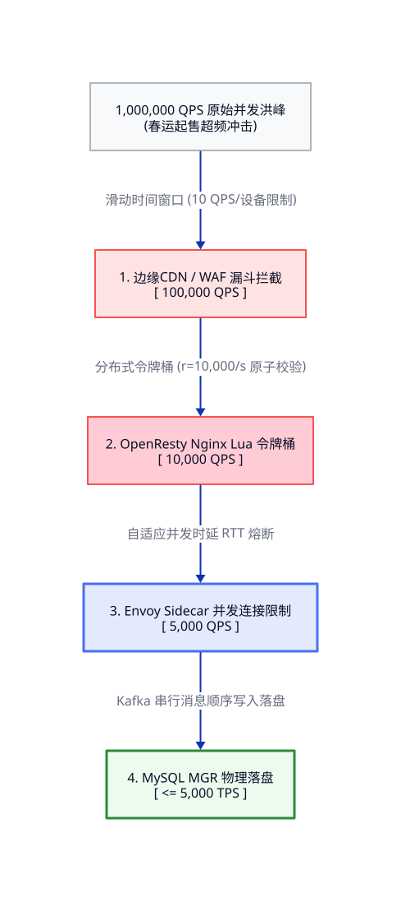
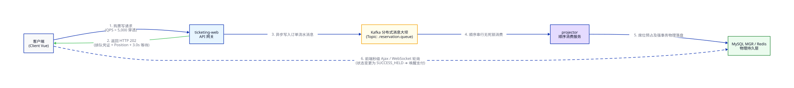

# ⚡ 12306 SRE 极限过载稳定性保障：多级限流、熔断降级与动态排队白皮书

在春运高峰、热门线路放票的黄金 10 秒内，12306 系统面临的瞬时并发流量（QPS）会发生数万倍的非线性暴增（如从常态 10k QPS 瞬间飙升至 1,000k+ QPS）。为了防止这种极限洪峰击穿核心有状态数据层（MySQL MGR / Redis），SRE 团队必须设计、落地并部署 **多级刚性流量拦截大坝、自适应异步虚拟排队系统与服务高可用熔断降级控制矩阵**。

---

## 1. 极限流量过载模型与级联故障特征 (The Overload & Cascading Failure)

当瞬时请求量严重超出系统物理承载上限时，若缺乏刚性控制，系统将呈现以下雪崩特征：

```text
  [ 洪峰瞬时涌入 ] ──► [ 网关连接数爆满 ] ──► [ 业务线程池耗尽 ] ──► [ 数据库 I/O 阻塞 ]
                                                                       │
  [ 全网大面积超时 ] ◄── [ 探针断开/脑裂 ] ◄── [ 内存OOM / 节点死机 ] ◄──┘
```

*   **业务挂死（Thread Pool Exhaustion）**：下游处理慢，导致上游计算服务（ticketing-web）的进程/线程因等待 I/O 返回而无法释放，瞬间耗尽 K8s 容器线程池，导致后续所有正常请求排队超时。
*   **服务死机（OOM & CPU Burn）**：为了维持海量连接，GC（垃圾回收）极度频繁，CPU 100% 锁死，最终触发操作系统 OOM-Killer 物理强制杀死进程。
*   **级联崩塌（Cascading Collapse）**：一个容器节点挂死导致负载自动漂移到其他节点，瞬间压垮存活节点，产生全网多米诺骨牌式物理崩塌。

---

## 2. 三级弹性限流大坝（Multi-Tier Rate Limiting Shield）

为了绝对确保核心写事务的吞吐不受噪声流量干扰，系统在物理链路的三个核心关卡设立了刚性拦截防御线。



```text
               [ 1,000,000 QPS 原始洪峰 ] 
                        │
                        ▼  第一道防线: 边缘网关 CDN / Edge WAF 限流
               [ 拦截 90% 恶意刷票/高频脚本 ] (Edge Token Bucket)
                        │
                        ▼  [ 100,000 QPS ]
               [ 第二道防线: Web网关 OpenResty Lua 原子拦截 ] (r_user / r_ip)
                        │
                        ▼  [ 10,000 QPS ]
               [ 第三道防线: 微服务 Envoy 自适应熔断 ] (Concurrency Limits)
                        │
                        ▼  [ 5,000 TPS ] (核心写数据库落盘)
               [ 核心 MGR 强物理写大坝 ]
```

### 2.1 第一道防线：边缘网关与 Edge WAF（Edge Protection）
*   **职能**：拦截机器人、高频抢票浏览器插件、多线程超频超速刷票脚本。
*   **算法机制**：基于 IP 和设备指纹（Device Fingerprint）的 **滑动时间窗口算法（Sliding Window）**。
*   **控制指标**：单个设备/单个公网出口，每秒限流 10 次。超频请求直接在边缘 CDN 节点丢弃，返回 `HTTP 429 Too Many Requests`，阻断 90% 以上的无用背景噪声，将洪峰压制在 100,000 QPS 以内。

### 2.2 第二道防线：Web 核心网关 OpenResty（Local Token Bucket）
*   **职能**：保护有状态微服务。
*   **算法机制**：基于 Redis 高性能二进制 LUA 脚本实现的 **分布式分布式令牌桶算法（Token Bucket）**。
*   **控制指标**：
    *   **接口级限流（API Rate-Limit）**：热门线路扣减车票接口，全国总流量常态锁死在 10,000 QPS（令牌生成速率 $R = 10,000/s$）。
    *   **用户级防刷（User Rate-Limit）**：单个已认证用户，抢票接口限流 1 次/s，多余请求直接在 Nginx 内存层秒级丢弃。

### 2.3 第三道防线：微服务接入层 Envoy Sidecar（Adaptive Concurrency Limit）
*   **职能**：防止系统线程池被写请求拖垮。
*   **算法机制**：**自适应并发限制（Adaptive Concurrency Limiting）**。
*   **控制指标**：Envoy 动态监控接口的往返时延（RTT）。当发现扣减占位接口延迟从常态 10ms 飙升至 100ms 时，自动收紧最大并发连接数（Max Concurrent Requests），将富余写请求自动排队或降级。

---

## 3. 分布式自适应虚拟排队大坝 (Adaptive Virtual Queuing)

在春运极速抢票场景下，自建物理机房的 MySQL MGR 强写事务落盘吞吐具有刚性上限：
`Max_Throughput_MGR = 5,000 TPS (Transactions Per Second)`

当网关层过滤后依然残留 **10,000 QPS** 的强有状态写请求时，如果不加以缓冲，直接让其穿透并发写入 MySQL，必将引发物理行锁超时、死锁挂死。



### 💡 破局设计：自适应内存排队缓冲区（Adaptive Virtual Queue）
当接口请求率超出系统处理阀值时，系统自动无缝切换至 **分布式异步虚拟排队模型**：

```text
               [ ticketing-web 写请求 ] 
                        │
                        ├────► [ 核心 TPS <= 5,000 ] ──► 直连写库（极速响应）
                        │
                        └────► [ 核心 TPS  > 5,000 ] ──► 触发排队大坝
                                                               │
   [ 客户端 (轮询检查等待状态) ] ◄── 返回排队状态 (HTTP 202) ◄───────┤
                                                               │
                                         写入 Kafka 队列 ◄─────┘
                                               │
                                               ▼ (顺序消费)
                                         [ projector ] ──► 写入 Redis / MySQL 
```

#### ① 排队判定与状态写入（Active Queue Ingestion）
*   购票请求不再直接同步调用扣减占位服务。
*   网关本地生成全局唯一的 **队列追踪 ID（Queue_ID）**，并向前端返回 `HTTP 202 Accepted`，Response Body 携带排队凭证及预计等待时间。
*   请求数据被作为高性能的消息体，推送至 **Kafka 极速消息队列**中：
    *   **Topic**：`t12306.reservation.queue.{schedule_id}` (按车次建立物理分区 Partition，保障单车次写绝对顺序串行，彻底消除死锁)。

#### ② 自适应排队等待时间计算公式（Adaptive Wait-Time Estimator）
网关通过 Redis 中常态维护的队列深度（Queue_size）和当前数据库物理吞吐（TPS），使用 **纯 ASCII 算式自适应、无偏差** 地向用户返回其当前排队进度：

```text
  [ 预计等待时间 X 秒 ] = [ 当前用户在队列中的排队位置 (Position) ] / [ 核心 MGR 强落盘吞吐率 (TPS) ]
```

*   **推导范例**：若用户排在车次队列第 15,000 位，当前 Kafka 消费 MGR 的实测吞吐为 5,000 笔/s：
    `Wait_Time = 15000 / 5000 = 3.0s`
*   **前端交互**：用户页面展示：“抢票请求已受理，正在排队中（当前排在第 15,000 位，预计等待 3.0 秒），请勿刷新”。前端每 1 秒发起一次轻量级 Ajax 轮询（Polling）或通过 WebSocket 实时更新 Position 进度。

#### ③ 异步消费与事务落盘（Sequence Consumer）
*   有状态消费服务 `projector` 从 Kafka 顺序拉取消息。
*   调用 Redis 段位图 LUA 极速扣占，成功后直接提交 MySQL MGR 执行底层物理行锁事务落盘。
*   将订单状态更新为 `SUCCESS_HELD`，更新 Redis 中该 `Queue_ID` 的状态为“购票成功，请在 45 分钟内支付”。
*   前端轮询监听到状态变更为 `SUCCESS_HELD`，瞬间跳转至支付页面。

---

## 4. 熔断与优雅降级控制矩阵 (Circuit Breaker & Graceful Degradation)

当不可抗力导致系统局部瘫痪（如某台 Leaf 交换机故障、某 Redis 分片死机）时，系统启动 **优雅降级控制矩阵**，确保主交易链路（购票）死不崩溃。

| 故障组件/微服务 | 触发条件机制 (Trigger Condition) | SRE 刚性降级与自愈策略 (Degradation & Self-Healing Play) |
| :--- | :--- | :--- |
| **推荐车次微服务** | 响应时延 RTT > 200ms 或 5xx 错误率 > 5% | **熔断降级**：立即阻断对个性化车次推荐引擎的调用。页面直接返回全国统一样式的“常态固定车次静态缓存”，保住主查询不挂。 |
| **历史余票统计查询** | 统计库 CPU 负载 > 90% | **无缝降级**：关闭复杂的模糊历史车票查询（如“去年今天我买的票”）。将余票展示由“精确到个位数（1张）”无缝降级为模糊范围展示（如“有 / 无 / 少量”），极大降功耗。 |
| **短信发送/推送微服务**| Kafka 积压超过 50,000 笔消息 | **异步延时降级**：停止对买票用户发送实时扣票短信。买票成功后页面直接提示“出票成功，请在[订单中心]查看”，短信延迟在 30 分钟内补发。 |
| **核心预占 Redis A 节点**| 物理死机或哨兵切换（15秒滑窗） | **MySQL 降级应急接管**：购票请求越过该 Redis Key，直接击穿到有状态 MySQL。虽然处理性能下降 50%，但由于排队大坝已将 TPS 压在 5000 以内，MySQL MGR 强物理行锁能 100% 安全接管，业务不停摆。 |

---

## 5. 12306 SRE 稳定防线：限流降级布线指标 (SRE Playbook Metrics)

| 稳定防护参数指标 | 12306 生产级刚性设定门槛 (SRE Rigid Target) | 备注与控制用途 (Architectural Purpose) |
| :--- | :--- | :--- |
| **边缘 CDN WAF 阈值** | **每设备最高 10 QPS / 接口** | 边缘防御，阻断恶意的插件超频抢票与扫描探针。 |
| **分布式排队触发 TPS** | **当总写请求 QPS > 5,000/s 时** | 自动平滑切换为异步 Kafka 排队，防止击穿数据库。 |
| **前端状态轮询频率** | **1次 / 1,000ms (1秒)** | 避免前端秒级超频轮询自身将网关层重新压垮。 |
| ** Envoy 熔断检测滑窗** | **10 秒滑动窗口，100 次最小调用** | 确保统计样本充足，防止因偶发抖动频繁误切。 |
| **MGR 数据库行锁超时** | **`innodb_lock_wait_timeout = 2s` (2秒)** | 遇到行锁排队强制在 2 秒内释放，防止线程长期占位产生级联雪崩。 |
